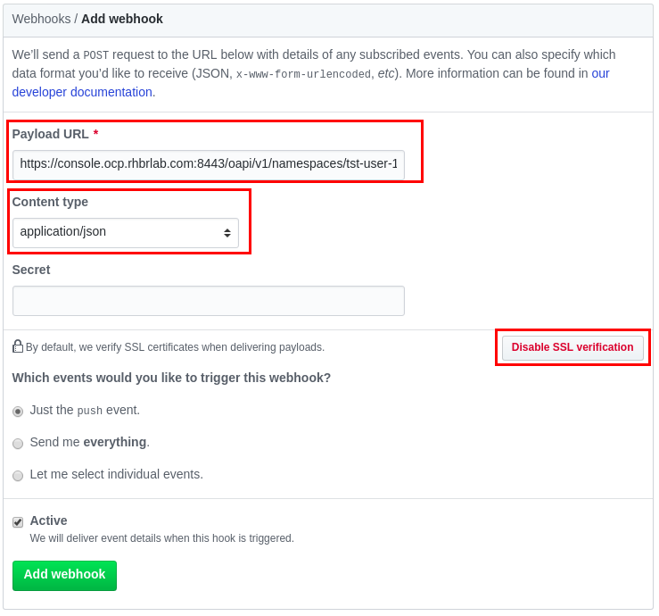
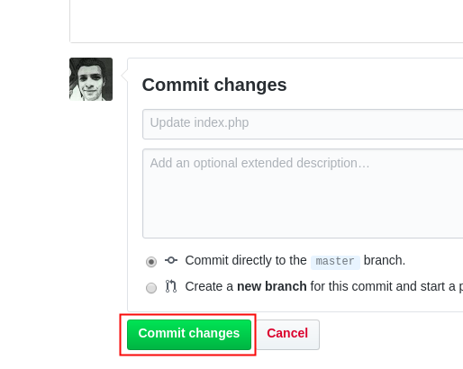
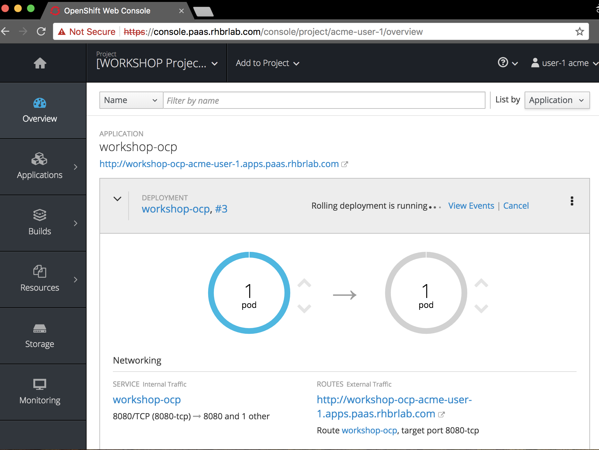

# 2.5 - Integração Contínua

Para que sempre que ocorra um commit o Openshift faça de forma automática o processo de build e deploy, iremos configurar  
um webhook, dessa forma o servidor git avisará o Openshift sempre que um commit novo ocorrer.

## Configuração webhook

Acesse a parte de builds.


Depois selecione `workshop-ocp`


Clique em `Configuration` e copie o link clicando no icone a direita


No _Github.com_:

* Selecione `Settings` no menu horizontal


* Selecione o `Webhooks` no menu lateral esquerdo 


* Selecione `Add Webhooks`, cole a URL copiada no campo `Payload URL`, no campo `Content Type` selecione a opção `application/json`
* Clique em `Disable SSL verification`
* Finalize no botão `Add webhook`



## Altere a aplicação

Para fazermos uma alteração na aplicação, vamos alterar a versão na página inicial da aplicação.

Clique no `Index.php`


Depois clique no lapis para editar


No `index.php` altere a linha com a versão da aplicação para versão 2.0.


```text
echo "<h1>Openshift Workshop v2.0</h1>";
```

Clique em `Commit changes`



Ou use a linha de comando do git para fazer essa alteraçao:

```bash
git add index.php
git commit -m "webhook adicionado"
git push
```

## Acompanhe o rolling deployment



Observe que não ocorre indisponibilidade durante o deployment

