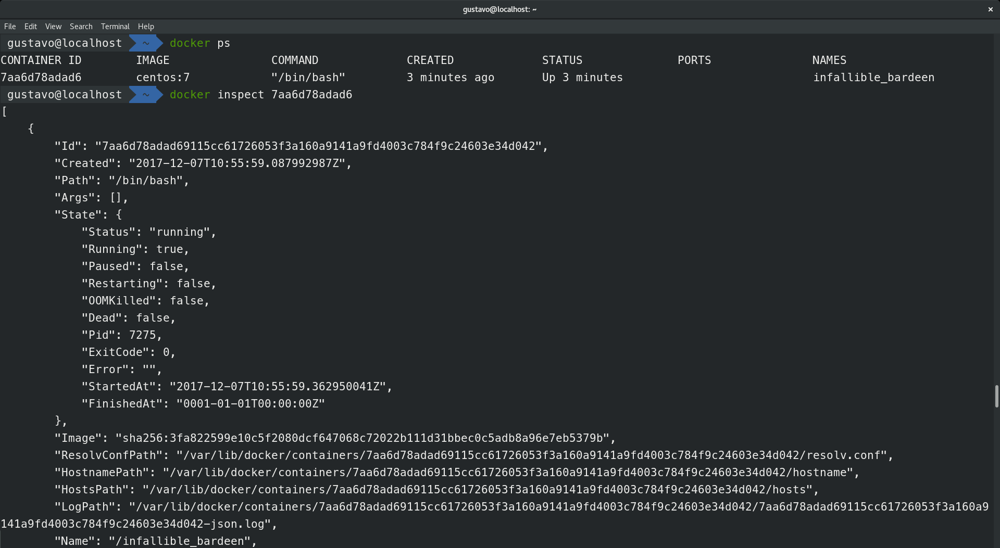

# Lab 1.2 - Operar

## Lab 1.2 - Objetivos

* Buscar informações containers em execução
* Executar processos adicionais em containers ativos
* Mapear volumes locais aos containers
* Mapear rede aos containers

Para as tarefas seguintes execute o comando abaixo:

```text
docker run -d busybox /bin/sh -c "while true; do echo Hello from Linux container [\$HOSTNAME];sleep 1;done"
docker run -d busybox /bin/sh -c "while true; do echo Hello from Linux container [\$HOSTNAME];sleep 2;done"
docker run -d busybox /bin/sh -c "while true; do echo Hello from Linux container [\$HOSTNAME];sleep 3;done"
```

Ou se preferir, execute tudo em um único comando:

```text
for i in `seq 3`; do docker run -d busybox /bin/sh -c "while true; do echo Hello from Linux container [\$HOSTNAME];sleep $i;done"; done
```

## Tarefas

### 1.2.1 - Monitorando Containers

Para buscar mais informações sobre os containers em execução, usa-se:

```text
# docker ps
```


No exemplo anterior não são listados containers terminados. Para visualizar a listagem completa, usa-se:

```text
# docker ps -a
```


Para visualizar os processos em execução dentro de um container, usamos:

```text
# docker top <id/nome>
```


Também podemos inspecionar os metadados do container, ou de uma imagem, através de:

```text
# docker inspect <id/nome/tag>
```



Tente obter o endereço IP de um container usando o comando abaixo:

```text
docker inspect --format '{{ .NetworkSettings.IPAddress }}' <id do container>
```


### 1.2.2 - Execução Ad-Hoc

Também podemos conectar em um container em execução e executar processos adicionais usando:

```text
# docker exec -it <container-id> /bin/sh
```


### 1.2.3 - Adicionando Persistência através de Volumes

Containers são essencialmente efêmeros. Entretanto, podemos mapear diretórios a eles e ter mecanismos de persistência de dados. Esse mecanismo é usado através do comando:

```text
# docker run -it -v /tmp/:/tmp_from_host:z centos:7
```

> `/tmp`: diretório no FS do Host
>
> `/tmp_from_host`: volume mapeado dentro do container
>
> `z`: em sistemas com SELinux habilitado, indica que conteúdo do volume pode ser compartilhado por múltiplos containers
>
> para mais detlahes sobre o volumes no Docker veja: [https://docs.docker.com/engine/admin/volumes/volumes/](https://docs.docker.com/engine/admin/volumes/volumes/)

No exemplo acima, o diretório /tmp/host do container será mapeado para o diretório /tmp no host hospedeiro

### 1.2.4 - Mapeando Portas de rede entre o container e o host

Por padrão, os containers utilizam de redes privadas locais no host hospedeiro. Dessa forma se faz necessário usar mapeamento de portas para expor serviços de rede, como uma aplicação web:

```text
# docker run -it -p 8080:80 httpd
```

No exemplo acima, a porta 80 do container \(httpd\) será exposta na porta 8080 do host hospedeiro

para se certificar disso use o comando abaixo:

```text
docker port <id do conatiner httpd>
```

execute o teste abaixo tentando acessr a porta `8080` a partir do host \(fora do container\):

```text
curl http://localhost:8080
```

Ao invés de mapear manualmente, podemos usar portas aleatórias:

```text
# docker run -it -P httpd
```

### 1.2.5 Monitorando o uso de recursos do container

Para monitorar a quantidade de recursos que um container está consumindo em um host, podemos executar o comando

```text
docker stats
```


E podemos visualizar somente de um container rodando o comando

```text
docker stats <id do container>
```

