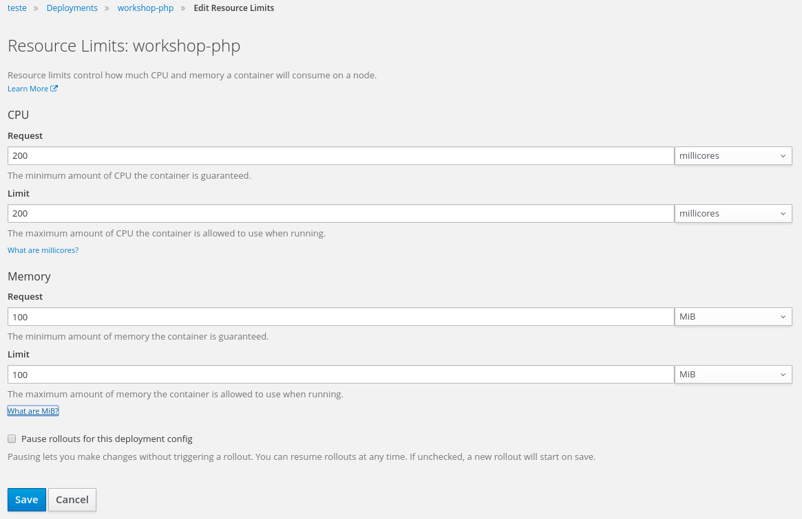
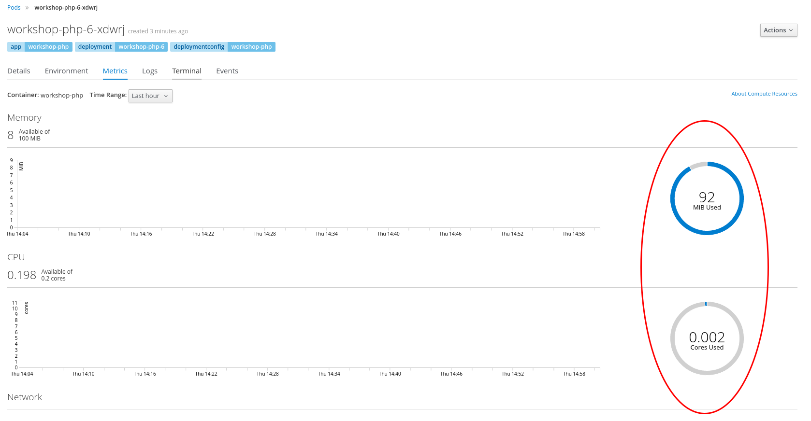
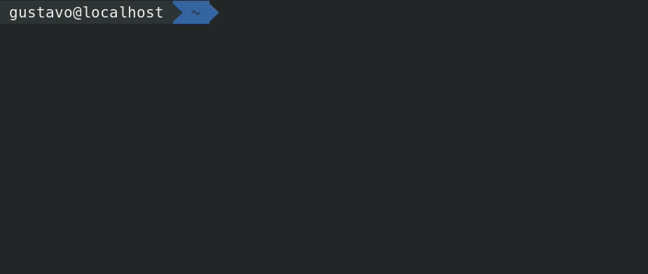
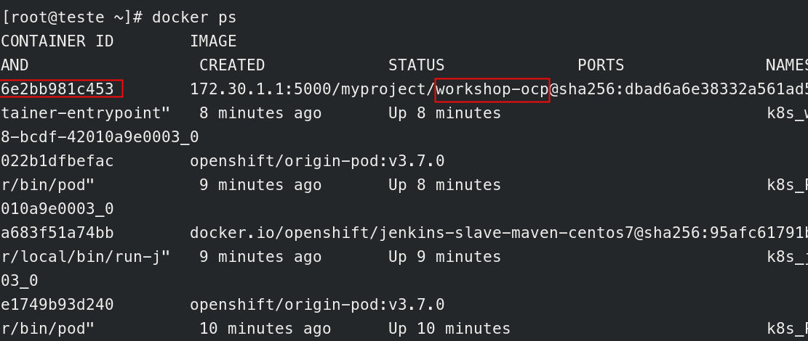

# 2.1.13 - Limite de Recursos

O Openshift permite que você limite a quantidade de recursos que serão disponibilizados para sua aplicação. Antes de continuarmos esse assunto, é preciso esclarecer duas nomenclaturas

## Request vs Limit

### **Request**

`Request` seria o equivalente ao valor mínimo de um determinado recurso. Esse campo é muito importante para o scheduler do Openshift. Toda vez que uma nova aplicação é criada, o Openshift escolhe automaticamente em qual nó do cluster ela irá rodar. Ele faz isso utilizando o valor do request como base para descobrir qual node tem o valor do request disponível.

### **Limit**

`Limit`** **é o valor máximo de um determinado recurso que o Openshift permitirá ser utilizado. Esse campo também é importante pois evita que sua aplicação possa consumir mais recurso do que foi alocado. Situações como _Out of Memory_ acabam sendo minimizadas quando este valor está configurado corretamente.

## QoS \(Quality of Service\) - TODO

* Garanteed
* Bustable
* Best Effort

## Unidades do Openshift - TODO

* Milicores
* GiB/MiB

## Configurando limite de recursos na nossa aplicação

Podemos limitar a quantidade de CPU e memória que nossa aplicação irá consumir. Para isso, precisamos acessar:

1. Selecione no menu vertical esquerdo a opção **Application** -&gt; **Deployments**
2. Na tabela a seguir, clique em **workshop-ocp**
3. No menu lateral superior, clique em **Actions** -&gt; **Edit Resource Limits**
4. Preencha os valors conforme abaixo



* **CPU - Request:** 200 milicores
* **CPU - Limit:** 200 milicores
* **Memory - Request:** 100 MiB
* **Memory - Limit:** 100 MiB

Nesse caso, estamos falando para o Openshift que nossa aplicação precisa de 20% \(200 milicores\) de 1 CPU livre para ser criada - somente nodes com essa condição receberão a aplicação - e que utilizará no máximo também 20% de 1 CPU.

O mesmo se aplica a memória. Openshift irá procurar nodes com 100 Megas de memória livres para colocar a aplicação e ela somente poderá usar 100 Megas de memória.

Nesse caso, nossa aplicação se encontra no QoS **Garanteed. **

Clique em **Save** e o Openshift irá iniciar um novo deploy da nossa aplicação.

Na página de metricas, agora vocês podem ver que existe um novo gráfico indicando o quanto de recurso temos disponível.



Testando o uso dos recursos

Vamos agora executar um processo dentro do container que consuma todo recurso possível de memória e CPU. O comando abaixo faz exatamente essa tarefa:

```bash
while :; do _+=( $((++__)) ); done
```

> AVISO: Use o comando acima com cuidado uma vez que ele pode travar o sistema operacional se utilizado em ambientes sem restrições de recurso.

Para executar esse comando dentro do container, vamos primeiro acessar nossa aplicação remotamente com o comando abaixo:

```text
oc rsh <nome do pod>
```



## Acompanhando o consumo de recursos

Podemos acompanhar o uso de recursos da aplicação pela Web Console ou pela linha de comando por meio do `docker stats`.

Primeiro vamos achar qual é o nosso container. Para isso, executamos:

```text
docker ps
```



Agora que achamos nossa aplicação, basta executar:

```text
docker stats <id do container>
```


O uso de CPU e memória não devem passar do que limitamos no início desse lab.

