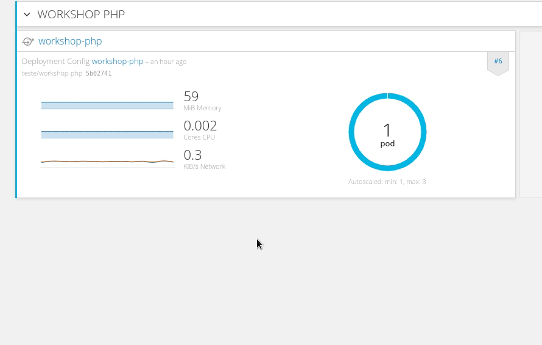
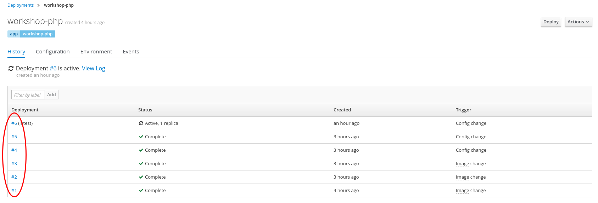
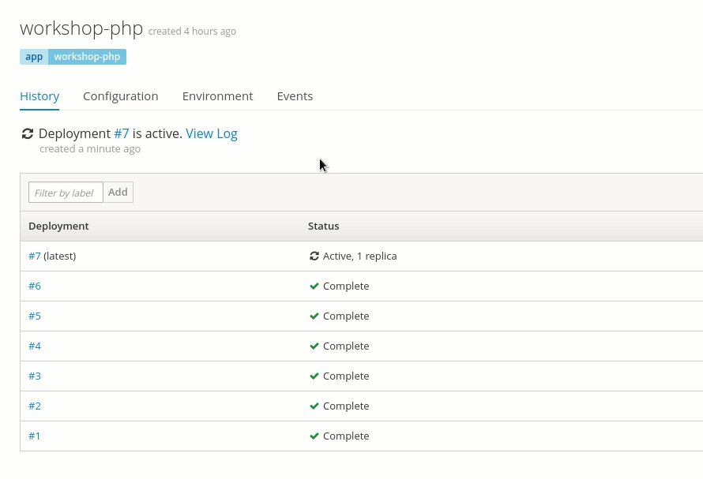

# 2.1.15 - Rollback

O Openshift controla todas as versões da sua aplicações e de seus respectivos artefatos. Toda vez que é lançada uma nova versão da aplicação ou quando é realizada alguma alteração como por exemplo a quantidade de recursos do container, o Openshift mantém o histórico de todas elas em uma tabela dentro da página de deployments.

Na página inicial, o número que aparece perto do container seguido de um \# é a versão atual da aplicação.

Nesse exemplo, estamos na nossa sexta versão da aplicação.

Para visualizar todas as versões podemos fazer isso da seguinte forma:

Na tela seguinte, temos o histórico de todas as versões do nosso container.

## Executando o rollback

Para fazer o rollback, basta acessar a versão que queremos e depois clicar no botão **Rollback**

